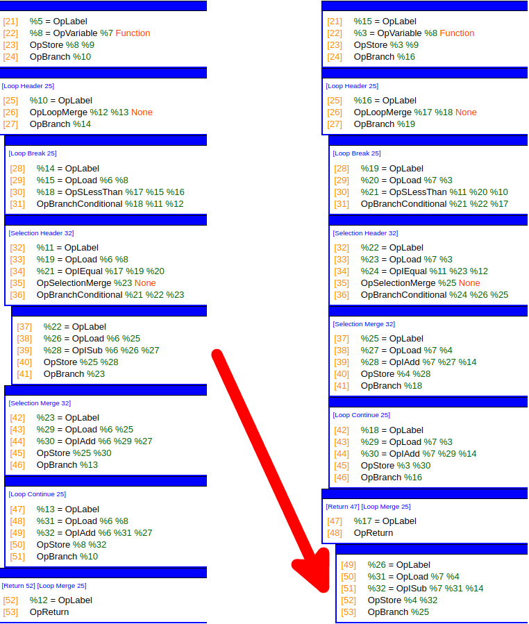

# CFG Unordered Nesting

The SPIR-V spec has some [CFG requirements](https://www.khronos.org/registry/spir-v/specs/unified1/SPIRV.html#_a_id_structuredcontrolflow_a_structured_control_flow) for the ordering of blocks in a function with regards to two blocks having to `dominate`, `strictly dominate`, and `post dominate` each other.

Outside of these requirements, SPIR-V doesn't require basic blocks to be in "structured order". This means the physical ordering of the blocks in the module need not be nested according to the structure. This means any consumer of SPIR-V **can't walk through a function in order and keep a stack of nesting information**.

## Simple example

- [example GLSL](examples/cfg_unordered_nesting/simple.comp)
- [SPIR-V binary 0](examples/cfg_unordered_nesting/simple_0.spv) | [SPIR-V disassembled 0](examples/cfg_unordered_nesting/simple_0.spvasm)
- [SPIR-V binary 1](examples/cfg_unordered_nesting/simple_1.spv) | [SPIR-V disassembled 1](examples/cfg_unordered_nesting/simple_1.spvasm)

Taking a simple GLSL compute shader with two levels of nesting:

```glsl
for (int i = 0; i < 4; i++) {
    if (i == 3) {
        x--;
    }
    x++;
}
```

Using [glslang](https://github.com/KhronosGroup/glslang) it produces structured ordering of the nesting, but as shown in the picture, it is valid to move the `OpBranchConditional` true case block to the bottom of the function.



It is important to note that the `%22 = OpLabel` selection construct block could **not** be moved above in the function because the selection header block (`%11 = OpLabel`) must dominate it.

## Fixing with SPIRV-Tools

SPIRV-Tools has a function that goes and [computes the structured order](https://github.com/KhronosGroup/SPIRV-Tools/blob/d20c9c2cf3fb74fb6cf3738aceaa2cd50cc33633/source/opt/cfg.h#L66) for various passes in `spirv-opt`. There is not a dedicated pass to just restructuring, instead it is just built in to some passes.

The simplest way to see this in action is running:

```bash
spirv-opt --merge-return chapters/examples/cfg_unordered_nesting/simple_1.spv -o simple_1_fixed.spv
```
