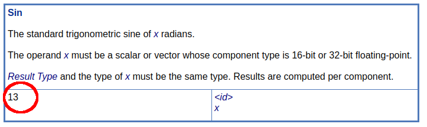

# Extended Instruction Sets

[Extended instruction sets](https://www.khronos.org/registry/spir-v/specs/unified1/SPIRV.html#_a_id_extinst_a_extended_instruction_sets) allow SPIR-V to at a core to be agnostic as many high-level shading languages describe rules around the same instructions differently.

> Example: The accuracy for an instruction such as `sin()` might be different in GLSL shaders than it is in OpenCL kernels

## Separate Spec

All extended instruction sets are specified in independent specifications as [listed in the registry](https://www.khronos.org/registry/spir-v/#extins).

There are three things needed when referring to an extended instruction set

1. Reference the [extended instruction set spec](https://www.khronos.org/registry/spir-v/specs/unified1/)
2. Use the header in [SPIRV-Headers](https://github.com/KhronosGroup/SPIRV-Headers/tree/master/include/spirv/unified1)
    - Example: `GLSL.std.450.h`
3. Be aware the header was generated from the grammar JSON file in [SPIRV-Headers](https://github.com/KhronosGroup/SPIRV-Headers/tree/master/include/spirv/unified1)
    - Example: `extinst.glsl.std.450.grammar.json`

## Example using extended instruction sets

Looking at a simple GLSL shader which uses `sin()`

```
#version 450

layout(location = 0) in float inputValue;

void main() {
    float xpos = sin(inputValue);
    gl_Position = vec4(xpos, 1.0, 1.0, 1.0);
}
```

produces the following SPIR-V Assembly

```
 1:           ExtInstImport  "GLSL.std.450"

 6:           TypeFloat 32
 9:           TypePointer Input 6(float)
10:  9(ptr)   Variable Input

 8:  7(ptr)   Variable Function
11:  6(float) Load 10(inputValue)
12:  6(float) ExtInst 1(GLSL.std.450) 13(Sin) 11
              Store 8(xpos) 12
22:  6(float) Load 8(xpos)
```

Breaking this down:

- Need to import the name of the extended instruction set being added with `OpExtInstImport`
- Use `OpExtInst`
    - Set the `Set` field to the imported non-semantic extension
    - Set the `Instruction` to the non-semantic extension specific instruction being added
        - For `GLSL.std.450` it is listed as being instruction `13` in the [extended instruction set spec](https://www.khronos.org/registry/spir-v/specs/unified1/GLSL.std.450.html)
        - 