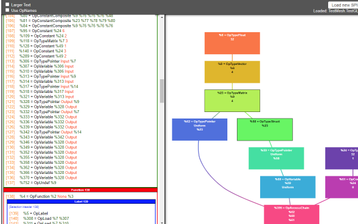

# Khronos Provided Tooling

The two main pieces of tooling Khronos provides for SPIR-V are the [SPIRV-Headers](https://github.com/KhronosGroup/SPIRV-Headers) and [SPIRV-Tools](https://github.com/KhronosGroup/SPIRV-Tools)

Both repos have very good documentation in their README files, so the following is a much more brief overview

## SPIR-V Headers

This the Khronos Group way of providing a nice to use header file to interface with SPIR-V instead of people trying to generate their own. The [SPIRV-Headers](https://github.com/KhronosGroup/SPIRV-Headers) repo uses grammar files written in JSON to [generate interface files](https://github.com/KhronosGroup/SPIRV-Headers/tree/master/include/spirv/unified1) for many languages. If a language you use for tooling is not provided, please bring up as an issue in the SPIRV-Header's repo

A quick [example](https://github.com/KhronosGroup/SPIRV-Headers/tree/master/example) to show how easy it is to use the headers

```cpp
#include <spirv/unified1/spirv.hpp>

const spv::Op kNop = spv::OpNop;
```

## SPIR-V Tools

The [SPIRV-Tools](https://github.com/KhronosGroup/SPIRV-Tools) repo contains many utilities such as a validator, optimizer, linker, fuzzer, and more.

All these tools can be built as a standalone binary which is just a small wrapper around the `libSPIRV-Tools` library. For someone who wants to also leverage SPIRV-Tools, there is a [libspriv](https://github.com/KhronosGroup/SPIRV-Tools/tree/master/include/spirv-tools) header file that can be used.

> Example: The reference GLSL compiler, [glslang](https://github.com/KhronosGroup/glslang), depends on `libSPIRV-Tools` to provide an option to optimize the out

The main goal behind this repo is to provide a single location for very common tools to prevent people from having to re-write their own. The end user can use these tools either by themselves or incorporate them with their tools. The repo is also Apache License 2.0 and always open for contributions.

## SPIR-V Visualizer

The [SPIRV-Visualizer](https://github.com/KhronosGroup/SPIRV-Visualizer) is a client side only Javascript tool to visualize a SPIR-V Module binary. [Live link](https://www.khronos.org/spir/visualizer/)

