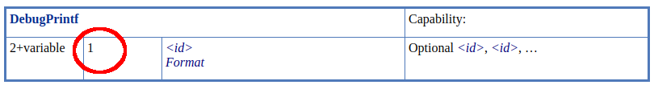

# Non-Semantic Instructions

> Non-Semantic can be looked at as just a special case of an [extended instruction set](./extended_instruction_sets.md)

The addition of the [SPV_KHR_non_semantic_info](http://htmlpreview.github.io/?https://github.com/KhronosGroup/SPIRV-Registry/blob/master/extensions/KHR/SPV_KHR_non_semantic_info.html) extension adds the ability to declare extended instruction sets that have no semantic impact and can be safely removed from a module. This uses the [OpExtInstImport](https://www.khronos.org/registry/spir-v/specs/unified1/SPIRV.html#OpExtInstImport) and [OpExtInst](https://www.khronos.org/registry/spir-v/specs/unified1/SPIRV.html#OpExtInst) instructions.

This was added so tools such as the Vulkan Validation Layers, RenderDoc, etc could inject SPIR-V instructions to aid in tooling without worrying about the implementation compiler crashing from an unknown instruction.

## Using non-semantic

> The following will be using the [Debug Printf](https://vulkan.lunarg.com/doc/sdk/latest/windows/debug_printf.html) non-semantic [instruction](http://htmlpreview.github.io/?https://github.com/KhronosGroup/SPIRV-Registry/blob/master/nonsemantic/NonSemantic.DebugPrintf.html) as an example.

Taking a GLSL shader of

```glsl
#version 450
#extension GL_EXT_debug_printf : enable

void main() {
    float myfloat = 2.0;
    debugPrintfEXT("Here are two float values %f, %f", 1.0, myfloat);
}
```

the output SPIR-V Assembly roughly looks like

```swift
       Extension  "SPV_KHR_non_semantic_info"
13:    ExtInstImport  "NonSemantic.DebugPrintf"

2:     TypeVoid
10:    String  "Here are two float values %f, %f"
       SourceExtension  "GL_EXT_debug_printf"

14:  2 ExtInst 13(NonSemantic.DebugPrintf) 1(DebugPrintf) 10 11 12
```

Breaking this down:

- First need to make sure the `SPV_KHR_non_semantic_info` is enabled
- Need to import the name of the non-semantic extension being added with `OpExtInstImport`
- Use `OpExtInst`
    - Set the `Set` field to the imported non-semantic extension
    - Set the `Instruction` to the non-semantic extension specific instruction being added
        - For `DebugPrintf` it is listed as being instruction `1` in the [extension spec](http://htmlpreview.github.io/?https://github.com/KhronosGroup/SPIRV-Registry/blob/master/extensions/KHR/SPV_KHR_non_semantic_info.html)
        - 

### Revisions

Some non-semantic extensions have multiple revisions. Some extensions will append the version on the end of the string, for example:

```swift
OpExtInstImport  "NonSemantic.ClspvReflection.1"  // revision 1
OpExtInstImport  "NonSemantic.ClspvReflection.2"  // revision 2
```

The details of versioning and the string to detect can be found per extension in the [SPIRV-Registry](https://github.com/KhronosGroup/SPIRV-Registry/tree/main/nonsemantic)

## Adding a new non-semantic extension

> Set of instructions to get a non-semantic extension added

- Add to the [SPIRV-Registry](https://github.com/KhronosGroup/SPIRV-Registry/tree/master/nonsemantic) repo
    - [Example PR](https://github.com/KhronosGroup/SPIRV-Registry/pull/61/files)
- Add to the [SPIRV-Headers](https://github.com/KhronosGroup/SPIRV-Headers) repo
    - Add a grammar file at `include/spirv/unified1/extinst.nonsemantic.<INSERT_NAME>.grammar.json`
    - Add line to bottom of the [generator script](https://github.com/KhronosGroup/SPIRV-Headers/blob/master/tools/buildHeaders/bin/makeExtinstHeaders.py)
        - `mk_extinst('NonSemantic<INSERT_NAME>', 'extinst.nonsemantic.<INSERT_NAME>.grammar.json')`
    - Run script ([as described in the README](https://github.com/KhronosGroup/SPIRV-Headers#generating-c-headers-for-extended-instruction-sets)) to generate the C header file.
    - [Example PR](https://github.com/KhronosGroup/SPIRV-Headers/pull/145/files)