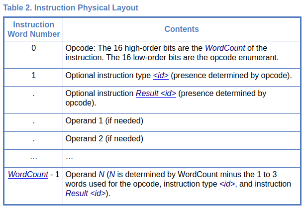
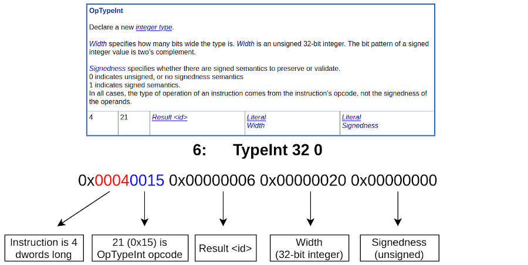

# Parsing Instructions

> This chapter goes over tips for parsing a stream of SPIR-V instructions
>
> SPIR-V Tools has a reference parser found in [binary.cpp](https://github.com/KhronosGroup/SPIRV-Tools/blob/master/source/binary.cpp)

Parsing of SPIR-V consists of 2 main components, the header and the instructions.

## Header

Because of the known magic number as the first dword in the module, this can be used to decide if the module is big or little endianness.

From here parsing the header is a simple as the following pseudo code:
```cpp
// spvFixWord used to handle endianness
uint32_t magic     = spvFixWord(binary[SPV_INDEX_MAGIC_NUMBER], endian);
uint32_t version   = spvFixWord(binary[SPV_INDEX_VERSION_NUMBER], endian);
uint32_t generator = spvFixWord(binary[SPV_INDEX_GENERATOR_NUMBER], endian);
uint32_t bound     = spvFixWord(binary[SPV_INDEX_BOUND], endian);
uint32_t schema    = spvFixWord(binary[SPV_INDEX_SCHEMA], endian);
```

## Instructions

After parsing the header, the rest of the SPIR-V Module is just a stream of instructions. The SPIR-V Spec describes the [Instruction Physical Layout](https://www.khronos.org/registry/spir-v/specs/unified1/SPIRV.html#_a_id_physicallayout_a_physical_layout_of_a_spir_v_module_and_instruction) as:



Here is some basic code to help visualize the logic needed for parsing each instruction

```cpp
// uint32_t module[];
uint32_t x = GetCurrentOffsetInModule();
uint32_t instruction = module[x];

uint32_t length          = instruction >> 16;
uint32_t opcode          = instruction & 0x0ffffu;
uint32_t nextInstruction = module[x + length];
```

Taking a look at a few lines of disassembled SPIR-V

```
2:   TypeVoid
3:   TypeFunction 2
6:   TypeInt 32 0
```

The assembled binary representation is as followed

```
0x00020013 0x00000002
0x00030021 0x00000003 0x00000002
0x00040015 0x00000006 0x00000020 0x00000000
```

Using `OpTypeInt` as an example to show the mapping more clearly



Here is another example

```
44:      6(int)     IAdd 43 40
45:     41(ptr)     AccessChain 38 19 39
                    Store 45 44

// in binary form

0x00050080 0x00000006 0x0000002c 0x0000002b 0x00000028
0x00060041 0x00000029 0x0000002d 0x00000026 0x00000013 0x00000027
0x0003003e 0x0000002d 0x0000002c
```