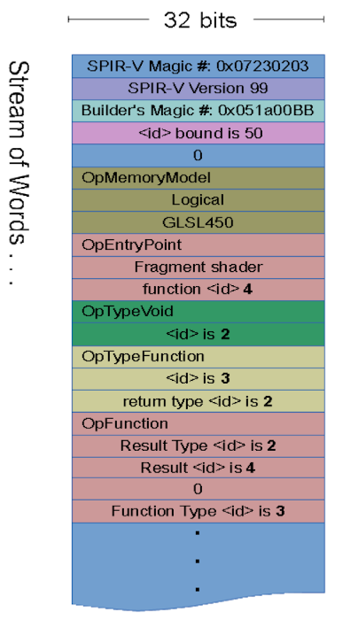
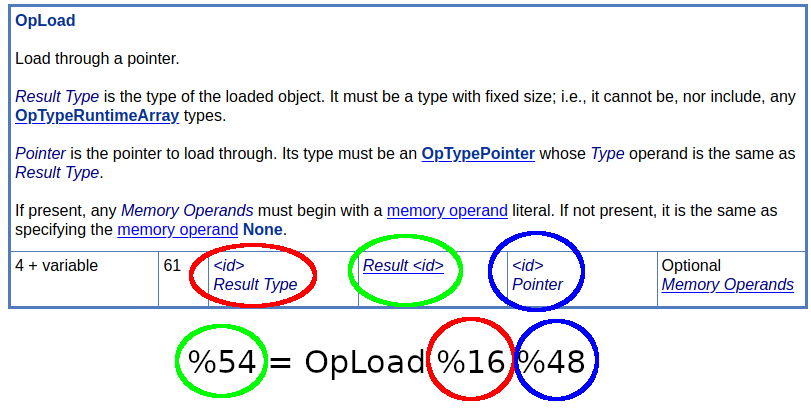
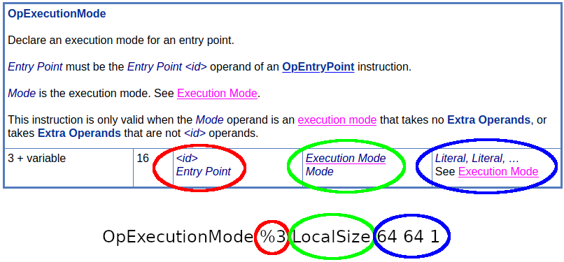

# Internals of SPIR-V

A SPIR-V [module](https://www.khronos.org/registry/spir-v/specs/unified1/SPIRV.html#_module) is a single unit of SPIR-V, most commonly found in a `.spv` file. Because SPIR-V is used in binary form, developers tend to reference the disassembled form instead (sometimes referred to as SPIR-V Assembly).

Small example of SPIR-V Assembly
```
     OpCapability Shader
     OpMemoryModel Logical Simple
     OpEntryPoint GLCompute %3 "main"
     OpExecutionMode %3 LocalSize 64 64 1
%1 = OpTypeVoid
%2 = OpTypeFunction %1 ; comment
%3 = OpFunction %1 None %2
%4 = OpLabel
     OpReturn
     OpFunctionEnd
```

The spec gives a [full example](https://www.khronos.org/registry/spir-v/specs/unified1/SPIRV.html#_example) of a simple GLSL shader to SPIR-V Assembly

A SPIR-V module is a single linear stream of [words](https://www.khronos.org/registry/spir-v/specs/unified1/SPIRV.html#Word). The full [physical layout](https://www.khronos.org/registry/spir-v/specs/unified1/SPIRV.html#PhysicalLayout) of the module is well described in the spec. Here is a visual diagram showing the layout.




## Reading SPIR-V Assembly

[SPIRV-Tools](https://github.com/KhronosGroup/SPIRV-Tools/blob/master/docs/syntax.md) has a great breakdown of the syntax found in SPIR-V Assembly.

It is also very useful to use the spec when looking at SPIR-V Assembly.

Here is an example from a random set of SPIR-V Assembly line

```
%16 = OpTypeInt 32 1
%48 = OpVariable %47 Function
%54 = OpLoad %16 %48
%56 = OpSLessThan %25 %54 %55
```



Here is another example using

```
OpExecutionMode %3 LocalSize 64 64 1
```

