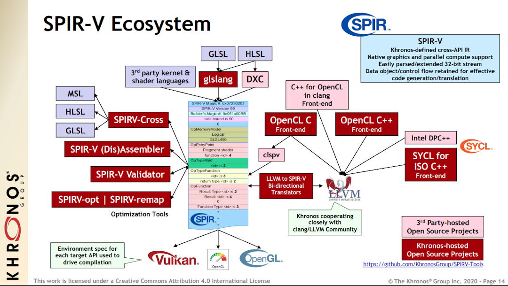

# What can you do with SPIR-V

As an intermediate representation, there is not much you can do with SPIR-V by itself. With any intermediate representation, there is a whole ecosystem around it for tools that both input and output SPIR-V.

)

## Use with Vulkan

SPIR-V is the language for Vulkan shaders. The Vulkan-Guide goes over in detail how to [map data in Vulkan to the SPIR-V module](https://github.com/KhronosGroup/Vulkan-Guide/blob/master/chapters/mapping_data_to_shaders.md).

Within the [Vulkan specification](https://github.com/KhronosGroup/Vulkan-Guide/blob/master/chapters/vulkan_spec.md):

* [Appendix A: Vulkan environment for SPIR-V](https://www.khronos.org/registry/vulkan/specs/1.2/html/vkspec.html#spirvenv)
  defines requirements for SPIR-V modules when used with Vulkan.  For example, it limits what
  [SPIR-V capabilities are supported by Vulkan](https://www.khronos.org/registry/vulkan/specs/1.2/html/vkspec.html#spirvenv-capabilities).
* [Section 14. Shader Interfaces](https://www.khronos.org/registry/vulkan/specs/1.2/html/vkspec.html#spirvenv)
  defines how data gets into and out of a Vulkan shader, and how those interfaces are expressed in SPIR-V.
  It also specifies interface matching rules for shaders combined in a single pipeline.
* Many Vulkan extensions add [shader features](https://github.com/KhronosGroup/Vulkan-Guide/blob/master/chapters/extensions/shader_features.md). Such a feature is paired with a corresponding SPIR-V extension.
  Sometimes the entire content of a Vulkan extension is to enable features from a SPIR-V extension,
  or to enable a newer version of SPIR-V itself.
* [Appendix B: Memory Model](https://www.khronos.org/registry/vulkan/specs/1.2/html/vkspec.html#memory-model)
  defines a memory consistency model: a detailed specification of how to reason about
  concurrent reads and writes to storage, and how to correctly synchronize those accesses.
  The model spans both actions in the API, and also operations SPIR-V shaders.
  This model is optional in Vulkan versions 1.0, 1.1, and 1.2, and is enabled by opting into
  the `VK_KHR_vulkan_memory_model` Vulkan extension, and using the `VulkanKHR` memory model within a SPIR-V
  module.

## Use with OpenCL

With an increasing number of OpenCL run-times supporting ingestion of SPIR-V, OpenCL developers may wish to use [offline compilation to precompile SPIR-V kernels](https://www.khronos.org/blog/offline-compilation-of-opencl-kernels-into-spir-v-using-open-source-tooling) that can be used portably across multiple OpenCL implementations.

There are also projects such as [clspv](https://github.com/google/clspv) which compile OpenCL C kernels to SPIR-V modules for use with Vulkan. More information can be found from the 2017 Siggraph BOF Presentation ([video](https://www.youtube.com/watch?v=Nx0u-9ZwrmQ&feature=youtu.be&t=3310) and [slides](https://www.khronos.org/assets/uploads/developers/library/2017-siggraph/06_3D-BOF-SIGGRAPH_Aug17.pdf#page=60)) and 2018 Siggraph ([video](https://www.youtube.com/watch?v=FCAM-3aAzXg&feature=youtu.be&t=21982) and [slides](https://www.khronos.org/assets/uploads/developers/library/2018-siggraph/05c-Adobe-clspv_Aug18.pdf))
